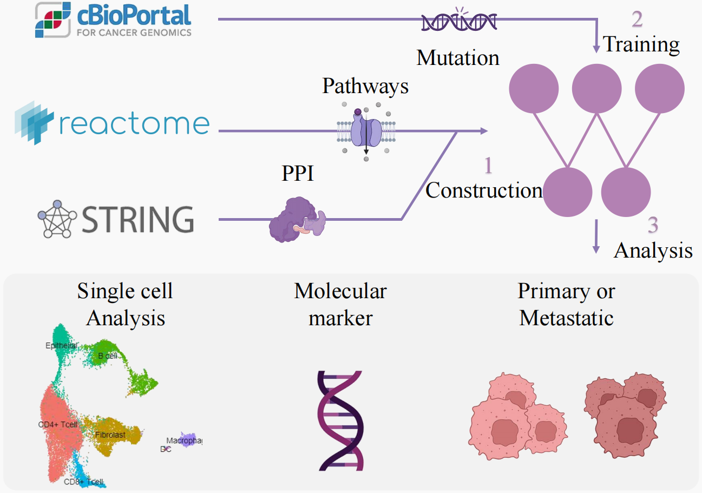

# Local Knowledge-Constrained Network: Identifying PRKCB in Breast Cancer and Validation through Single-Cell Interaction Analysis

**The code associated with this research will be made publicly available on GitHub after the publication of the manuscript. This policy is intended to protect the integrity of our findings until they are formally published. We appreciate your understanding and interest in our work.**